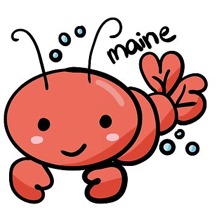

# Invertebrate Outbreak
### [ The Self-Immolating Sequel of the Nix-OpenClaw Story ]
---

<p align="center">
{ width="600" height="600" style="display: block; margin: 0 auto;" }
</p>

This is a mostly personal project. It's a less locked-down variant of the original
[openclaw/nix-openclaw](https://github.com/openclaw/nix-openclaw) project.

It keeps Nix and Home Manager packaging where useful, while allowing runtime
configuration, workspace files, plugins, skills, ACP servers, and experiments
to evolve outside the flake. The installation remains reproducible, but immutability for the installed ecosystem is optional.

Here's the site describing the original project for adherents to the socially acceptable, declarative "Nix way" approach (aka _most people_): [https://docs.openclaw.ai/install/nix](https://docs.openclaw.ai/install/nix)

#### Situational synopsis:
---

1. OpenClaw binaries cannot currently self-update independently. Nix places them in /nix/store, and Home Manager/flake updates remain authoritative. Runtime configuration is mutable, but installation is not.

Recommended self-update design:

  - Keep Nix as the base runtime.
  - Install versioned OpenClaw releases under $HOME/.openclaw/releases.
  - Maintain a mutable current symlink.
  - Add staged update, smoke testing, rollback, and opt-in switching.
  - Add an agentic changelog checker that compares release notes against installed plugins, skills, ACP servers, config schema,
    and runtime dependencies.

  - Treat the agent as a compatibility/risk assessor, not an automatic authority.

2. In official `nix-openclaw` (and almost all Nix packages), direct mutations are intentionally blocked. This can be really frustrating for ecosystems that have lots of plugins and other add-ons, and for codebases that progress at a breathtaking cadence.  

In _Invertebrate Jailbreak_, version, declarative skills can be managed through Nix/Home Manager, but outside that mode OpenClaw’s own mutable ecosystem can manage plugins, skills, and ACP servers independently, as well.

More flexible tool strategy separates:
  - Nix-managed base packages and trusted plugins.
  - Mutable user-managed extensions under $HOME/.openclaw/tools or $HOME/.openclaw/extensions.
  - A registry recording source, version, enabled state, and optional lock information.
  - Git/npm/local/ClawHub installation sources.
  - Inventory and compatibility checks across both managed and mutable tools.

  Changelog:

## How to Opt-in self-update

The default launcher remains Nix-managed. To let OpenClaw releases update
outside the flake, enable the personal mutable channel:

```nix
programs.openclaw.selfUpdate.enable = true;
```

After Home Manager activation, use:

```bash
openclaw-self-update status
openclaw-self-update check
openclaw-self-update review 2026.7.1
openclaw-self-update stage 2026.7.1
openclaw-self-update switch 2026.7.1
openclaw-self-update rollback
```

Releases live under `$HOME/.openclaw/releases`; configuration and workspace
state remain in their normal mutable locations. Staging does not activate a
release, and switching is explicit. If no mutable release is active, the
gateway falls back to the Nix package.

See Changelog for more details